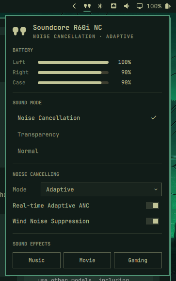

<h1 align="center">Omacore</h1>

<p align="center">
  Soundcore earbuds in the <a href="https://omarchy.org">Omarchy</a> bar: battery for each earbud and the case, ambient sound mode (Noise Cancelling / Transparency / Normal) with its own per-mode ANC settings, and Sound Effects, drawn in Omarchy's own panel idiom.
</p>

<p align="center">
  The <a href="https://omarchyplugins.com/plugin.html?id=io.github.thisisgm.omapods">omapods</a> plugin does this for AirPods. Omacore is the same idea for Soundcore.
</p>

<p align="center">
  
</p>

## How it looks

Click the Soundcore icon (right side of the bar) to open the panel above —
see **What it shows** below for what's in it.

## Install

Your earbuds must be paired over Bluetooth first (`omarchy bluetooth device`
or the stock Bluetooth panel). Then run the setup script, which installs
OpenSCQ30 (if missing), detects your earbuds, registers them, installs the
plugin and puts the widget in your bar:

```bash
omarchy plugin add https://github.com/birajdotdev/omacore.git --enable
~/.config/omarchy/plugins/io.github.birajdotdev.omacore/setup.sh
```

Or clone directly and run it:

```bash
git clone https://github.com/birajdotdev/omacore.git /tmp/omacore
/tmp/omacore/setup.sh
```

The script is interactive but safe to re-run at any time (idempotent), and
accepts `--yes` to pick the first Soundcore device it finds without prompts.

If you'd rather set everything up by hand, follow **Manual setup** below.

## What it shows

- **Which earbuds** — the panel title shows the friendly model name (e.g.
  "Soundcore R60i NC") from the "OpenSCQ30 model id" setting, not a generic
  "Soundcore".
- **Battery** for the left earbud, the right earbud and the case. Soundcore's
  hardware only reports ten discrete steps, so the widget shows a rounded
  percent rather than a raw sensor value.
- **Sound mode** — Noise Cancellation, Transparency or Normal — with the
  active mode checked, and one click or `n`/`t`/`o` to switch it. Selecting a
  mode reveals that mode's own settings below it, mirroring Soundcore's app:
  - **Noise Cancellation** shows an inline Mode dropdown (Manual / Adaptive /
    Multi-Scene) plus a Real-time Adaptive ANC toggle — shown regardless of
    which of the three is selected, same as the Soundcore app:
    - **Manual** additionally shows a 1-5 intensity level.
    - **Multi-Scene** additionally shows a Transport / Outdoor / Indoor
      picker as three side-by-side buttons.
    - **Wind noise suppression** — a toggle, one click or `w` (while in
      Noise Cancellation) to flip it.
  - **Transparency** shows a Fully Transparent / Vocal Mode picker.
  - **Normal** shows none of the above — only Sound Effects, below.
- **Sound Effects** (Soundcore's spatial audio) — Music / Movie / Gaming as
  three side-by-side buttons, always shown regardless of sound mode.

All of the above are only shown when openscq30 reports the setting at all
(model and firmware dependent — confirmed present on the R60i NC / P31i).
OpenSCQ30 exposes still more per-device settings (button remapping, EQ,
dual connections, …) — run `openscq30 device -a <mac> list-settings --json`
to see everything your earbuds support, and extend
`Model.js`/`Service.qml`/`Panel.qml` the same way the rest is wired if you
want more of it in the bar.

## How it works

Unlike [omapods](https://github.com/thisisgm/omarchy-pods) (AirPods, which
speaks Apple's own BLE protocol via a background daemon), there is no
background daemon here. [OpenSCQ30](https://github.com/Oppzippy/OpenSCQ30)'s
CLI opens a fresh Bluetooth connection on every invocation, so this widget
**polls**: a
timer runs `openscq30 device -a <mac> setting -g ... --json` every
`pollIntervalSec` seconds (30 by default) and parses the reply. Clicking any
row (sound mode, ANC mode, scene, sound effect, a toggle, …) runs
`setting -s <settingId>=<value>` and re-polls afterward.

## Requirements

- **[OpenSCQ30](https://github.com/Oppzippy/OpenSCQ30)'s CLI**, `openscq30`,
  on `PATH` (the setup script installs it for you). It is free/open-source
  (GPL-3.0-or-later) and not written by or affiliated with this plugin's
  author — it just happens to be the CLI this widget shells out to.

  **Version matters for newer devices.** R60i NC / P31i support landed in
  OpenSCQ30 v2.10.0. The `openscq30-cli-bin` AUR package may lag behind
  (it was pinned to v2.7.0 at the time this was written) — if
  `openscq30 list-models` doesn't list your `Soundcore...` id, skip the AUR
  package and let the setup script grab the official binary release instead.
  To install that manually:

  ```bash
  mkdir -p ~/.local/opt/openscq30
  gh release download v2.12.0 -R Oppzippy/OpenSCQ30 \
    -p 'openscq30-cli-linux-x86_64' -D ~/.local/opt/openscq30
  chmod +x ~/.local/opt/openscq30/openscq30-cli-linux-x86_64
  ln -sf ~/.local/opt/openscq30/openscq30-cli-linux-x86_64 ~/.local/bin/openscq30
  ```

  (Substitute the latest release tag for `v2.12.0` if a newer one exists.)

- Earbuds paired over the normal Bluetooth flow first (`omarchy bluetooth
  device` or the stock Bluetooth panel).

## Manual setup

If you'd rather not use the setup script, here's what it does by hand
(assumes openscq30 from **Requirements** above is installed, and your
earbuds are paired over Bluetooth):

1. Find the MAC address:

   ```bash
   bluetoothctl devices | grep -i soundcore
   ```

2. Register the device with OpenSCQ30 (its CLI keeps its own small database
   mapping MAC address → model, separate from BlueZ's pairing):

   ```bash
   openscq30 paired-devices add -a AA:BB:CC:DD:EE:FF -m SoundcoreD1202C
   ```

   Use `SoundcoreD1202C` for the **R60i NC**, `SoundcoreD1202` for the
   **P31i**. Run `openscq30 list-models` to see every supported model id —
   the exact id string (and whether it's prefixed `Soundcore...`) has
   changed between OpenSCQ30 versions, so trust `list-models` over any id
   written down here.

3. Sanity-check it talks to the earbuds:

   ```bash
   openscq30 device -a AA:BB:CC:DD:EE:FF list-settings --json | less
   ```

4. Install and enable the plugin (skip `add` if you already ran the
   **Install** command above), then set the same MAC address in its settings:

   ```bash
   omarchy plugin add https://github.com/birajdotdev/omacore.git --enable
   omarchy bar set io.github.birajdotdev.omacore macAddress "AA:BB:CC:DD:EE:FF"
   # If openscq30 isn't on PATH under that name (see Requirements above):
   omarchy bar set io.github.birajdotdev.omacore ctlPath "/full/path/to/openscq30"
   ```

   Settings can also be edited later from the Omarchy menu → Plugins, or
   directly in `~/.config/omarchy/shell.json`.

## Update / Remove

```bash
omarchy plugin update io.github.birajdotdev.omacore
omarchy plugin remove io.github.birajdotdev.omacore
```

`openscq30` and its paired-device database are untouched — remove them
separately with your AUR helper and `openscq30 paired-devices remove -a
<mac>` if you no longer want them.

## Keyboard

| Key | Action |
|-----|--------|
| `j` / `k`, `↓` / `↑` | move between rows |
| `←` / `→` | adjust the Manual ANC level, when it's the focused row |
| `enter` / `space` | activate the current row |
| `n` | Noise Cancellation |
| `t` | Transparency |
| `o` | Normal |
| `w` | toggle wind noise suppression (while in Noise Cancellation, if supported) |
| `r` | refresh |
| `tab` | move to the next panel |
| `esc` | close |

Every other setting (scene, transparency mode, sound effect) is reached by
moving the cursor to its row and pressing `enter`/`space`, or by clicking it
directly. The ANC Mode dropdown works the same way to open it; once open, its
own `j`/`k`/`↓`/`↑` and `enter` pick an option and `esc` closes it without
closing the panel. For a toggle row (wind noise suppression, real-time
adaptive ANC), a mouse click only registers on the switch itself, not the
row's label — keyboard `enter`/`space` on the row still works either way.

Left click opens the panel.

## Settings

| Setting | Default | Notes |
|---------|---------|-------|
| Bluetooth MAC address | empty | Required. Same address used in `paired-devices add`. |
| OpenSCQ30 model id | `SoundcoreD1202C` | Reference only, for the `paired-devices add` command above. |
| Poll interval (seconds) | 30 | How often the widget re-runs `openscq30 device ... setting -g ...`. |
| Path to the openscq30 CLI | empty | Leave empty to find `openscq30` on `PATH`. |
| Hide when unreachable | on | Leaves the bar entirely rather than sitting there with nothing to say. |
| Desktop notifications | on | Notifies on disconnect and when a bud/case battery drops to 20% or below (once per drop, via `omarchy-notification-send`). |

## Credits

The hard part is not this panel. It is
[OpenSCQ30](https://github.com/Oppzippy/OpenSCQ30) by **Oppzippy**, which
reverse-engineered Soundcore's BLE/RFCOMM control protocol across dozens of
devices. This panel only shells out to its CLI and draws what comes back.

## Licence

MIT. See [LICENSE](LICENSE). This plugin vendors no OpenSCQ30 code — it only
invokes the separately-installed `openscq30` binary, which is GPL-3.0-or-later
under its own project.
